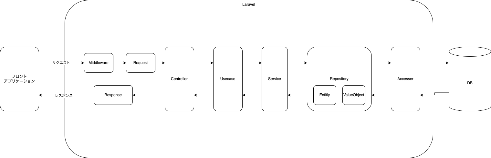

# アーキテクチャ構成
## app配下のディレクトリ構成

### Api利用アーキテクチャ概念図


```
app/
├── Console
├── Accessers
├── Domain
│   ├── Entities
│   ├── Repositories
│   ├── Services
│   ├── UseCases
│   └── ValueObjects
├── Exceptions
├── Foundations
├── Http
│   ├── Controllers
│   │   └── Auth
│   ├── Middleware
│   ├── Requests
│   ├── Responses
│   └── ViewComposers
├── Libraries
└── Providers
```

各ディレクトリの意味に関しては下記を参照

- Accessers  
  Database、Cache、Api等のデータにアクセスするクラスの置き場  
  各アクセスするクラスに応じてAccessers配下にディレクトリを作成してクラスを作っていく
  > ファイル名：{API名/テーブル名/Azure機能名}.php<br>

  > 形式：アッパーキャメルケース 例)User.php

```
ex)
Accessers/
├── Api
├── DB
├── Azure
│   ├── AzureAD
│   ├── AzureStorage
```


- Domain  
  ドメイン層はアプリケーション層に対して業務ロジック（業務的関心事）を提供するためのレイヤ。

- Domain/Entities  
  業務データの保持をするクラスの置き場。  
  同一性・連続性があるもの  
  エンティティとして扱うデータはデータとして一意性が担保されます。  
  システムに依存しない（ドメインモデル）

  > ファイル名：{ビジネスロジックを表現するオブジェクト名}.php<br>

  > 形式：アッパーキャメルケース 例)User.php
  

- Domain/Repositories  
  データ(Entityクラス)に対してのCRUD操作を提供するクラスの置き場。  
  リポジトリ-パターンを使用して実装する。

  > ファイル名：{機能名}Repository.php<br>

  > 形式：アッパーキャメルケース 例)DocumentListRepository.php
  

- Domain/Services  
  業務ロジックを提供するクラスの置き場。  
  ここでの関心事としては、業務データを操作するクラス郡となる。

  > ファイル名：{機能名}Service.php<br>

  > 形式：アッパーキャメルケース 例)DocumentListService.php


- Domain/UseCases 
  ServiceやEntityで用意したビジネスルールを、いつ、どのように利用するかを記載するクラスの置き場  
  ここでの関心後は業務ロジックや業務データ、ルールなどを使う方法になる。
  
  →今回の開発では、使用しない。

- Domain/ValueObjects  
  物事の性質を表現するオブジェクトを提供するクラスの置き場。  
  連続性しかもたない  
  物事の性質を表現するとは例えば、「色」、「通貨」のように  
  その属性だけが重要なオブジェクトであり、Entityクラスの反対の意味をなす。  
  基本的に *Immutable* オブジェクトとなる。
  システムに依存しない（ドメインモデル）

  > ファイル名：{物事の性質を表現するオブジェクト名}.php<br>

  > 形式：アッパーキャメルケース 例)User.php

- Foundations  
  機能を提供するために必要な土台となるクラスの置き場。

  例)　CSV特有の処理など業務とは分離して定義できる機能

  > ファイル名：{機能名}.php<br>

  > 形式：アッパーキャメルケース 例)Csv.php

- Http/ViewComposers  
  viewModelやResponderとか呼ばれたりする。  
  テンプレートに必用な情報を提供するクラスの置き場。

  →今回は利用しない

- Libraries  
  業務ロジックに関係がないけど、まとめておきたい処理クラスをここに集約。

  例)　Convert処理(日付変換・型変換・ファイル単位変換など)

  > ファイル名：{機能名}.php<br>

  > 形式：アッパーキャメルケース 例)Convert.php

- Http/Requests  
  リクエストのバリデーション処理をまとめる  
  ※FormValidationやAPIの場合のバリデーション

  > ファイル名：{機能名}Request.php<br>

  > 形式：アッパーキャメルケース 例)UserSaveRequest.php

- Http/Responses  
  ※API利用の場合、使用想定  
  レスポンスに関わる処理をまとめる

  > ファイル名：{機能名}Responder.php<br>

  > 形式：アッパーキャメルケース 例)UserListResponder.php

